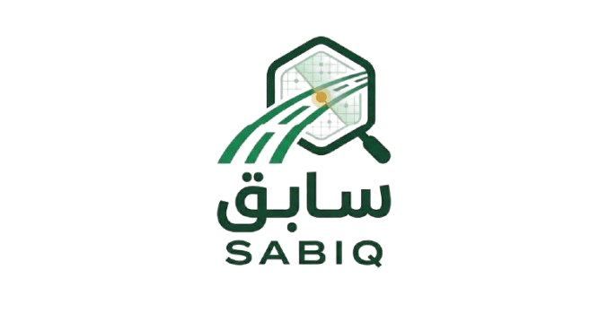

<div align="center">



#  SABIQ — سابق  

### Proactive Road Damage Detection

**Making roads safer… before accidents happen**


##  The Story

Every road tells a story… but not all damage is visible in time.

A small crack today can become a dangerous pothole tomorrow.  
Cities struggle with slow, expensive, and incomplete inspections.

  **What if roads could monitor themselves?**

**SABIQ** AI-powered system that detects cracks and potholes from dashcam/drone video, deduplicates detections.

---


</div>

---

## Project Objectives

**Problem:** Road surface defects such as potholes and cracks pose a serious risk to vehicle safety and traffic flow. When vehicles are damaged by poorly maintained roads, the responsible municipality is liable for compensation creating both a safety concern and a financial burden. Traditional manual inspections are slow, costly, and cannot cover an entire city effectively.

**Solution:** SABIQ automates road inspection using AI. Upload dashcam/drone video → detect defects → classify severity → store → prioritize repairs.

**Vision 2030 Alignment:**

- Smart Cities: Riyadh ranked 24th globally in IMD Smart Cities Index 2026  
- Quality of Life Program: Better roads = better daily life for millions  
- Year of AI 2026: Practical AI application in municipal services  

---

## Dataset

**Source:** RDD2022  

- 47,420 images from 6 countries, 55,000+ damage annotations  
- Split: Train 26,869 / Val 5,758 / Test 5,758  
- Merged 4 classes → 3: crack, other corruption, pothole  
- Augmented 7,788 pothole images (Albumentations) to fix class imbalance  
- Final training set: 34,657 images  

---

## Methodology

**1. Preprocessing:** Class merging (5→3), data cleaning, offline augmentation for potholes  

**2. Model:** YOLO26m (21.7M params, 74.7 GFLOPs) latest YOLO with C3k2 blocks and C2PSA attention  

**3. Training:** 3 iterative versions on A100 GPU  

**4. Video Deduplication:** ByteTrack (ECCV 2022) assigns unique ID per defect across frames. Same defect in 30 frames → stored once.  

 
---

## Challenges

| Challenge | Solution |
|----------|---------|
| Potholes only 10% of data | Albumentations augmentation (+7,788 images) |
| Same defect repeated 30x in video | ByteTrack tracking 1 ID per defect |
| Manual dedup was complex (50 lines) | ByteTrack replaced it (~10 lines) |

---

## Results

### Overall Performance

| Metric | V1 (YOLOv8m) | V2 (YOLO11n) | V3 (YOLO26m) | V4 (YOLO26m) 
|--------|-------------|-------------|--------------|--------------
| mAP50 | 0.636 | 0.572 | 0.621 | **0.636**  
| mAP50-95 | 0.351 | 0.312 | 0.345 | **0.349** 
| Precision | 0.658 | 0.600 | **0.717** | 0.687 
| Recall | **0.605** | 0.547 | 0.558 | 0.585 
---

### Per-Class Performance (V4 Final Model)

| Class | Images | Precision | Recall | mAP50 | mAP50-95 |
|-------|--------|-----------|--------|-------|----------|
| Crack | 3,266 | 0.714 | 0.520 | 0.605 | 0.321 |
| Other | 1,093 | 0.714 | 0.745 | 0.792 | 0.493 |
| Pothole | 544 | 0.635 | 0.491 | 0.512 | 0.233 |
| All | 5,758 | 0.687 | 0.585 | 0.636 | 0.349 |

---
## Project Structure
 
```
SABIQ/
├── NoteBooks/                          # Training & analysis notebooks
│   ├── 01_EDA_Cleaning.ipynb           # Exploratory data analysis & data cleaning
│   ├── 02_TrainY8_v1.ipynb             # V1: YOLOv8m baseline (5 classes)
│   ├── 03_TrainY11_v2.ipynb            # V2: YOLO11n lightweight baseline
│   ├── 04_TrainY26_v3.ipynb            # V3: YOLO26m + oversampling
│   └── 05_TrainY26_v4.ipynb            # V4: YOLO26m + Albumentations (final)
│
├── SABIQ_runs/                         # Training outputs
│   ├── yolo26v1/                       # V2 weights, metrics, confusion matrix
│   └── yolo26v2/                       # V3 weights, metrics, confusion matrix
│
├── backend/                            # FastAPI backend (deployed on HuggingFace)
│   ├── main.py                         # API: image/video detection + ByteTrack dedup
│   ├── Dockerfile                      # Docker container config
│   └── requirements.txt                # Python dependencies
│
├── database/
│   └── supabase/migrations/
│       └── 001_init.sql                # Database schema 
│
├── models/
│   └── README.md                       # Model documentation
│
├── README.md                           # This file
└── roadguard-pro-main.zip              # Frontend source code
```
## How to Run the Project

### Backend

```bash
git clone https://huggingface.co/spaces/Rahaf2001/sabiq-api
cd sabiq-api

pip install fastapi uvicorn ultralytics opencv-python-headless python-multipart lap

uvicorn main:app --reload --port 8000

 Open http://127.0.0.1:8000/docs to test

```

<div align="center">

## SABIQ Team  

**Ahad Alotaibi · Rahaf Alshahrani · Amjad Althobaiti**

---

</div>

## Team Roles

| Team Member | Role |
|-------------|------|
| **Ahad Alotaibi** | Trained and optimized the **YOLO26** model, and conducted real-world data collection experiments using drones, including system integration with aerial capture. |
| **Amjad Althobaiti** | Trained the **YOLO11** model and handled project deployment using **Docker**, ensuring scalable and efficient setup. |
| **Rahaf Alshahrani** | Trained the **YOLOv8** model, developed the user interface (UI) , and led project deployment on **Hugging Face** managed database integration using Supabase. |

---
## Team Spirit

We demonstrated exceptional collaboration, dedication, and mutual support throughout our project. We did not see ourselves as separate individuals or as “they,” but rather as one united team. Together, we overcame challenges and delivered impactful results.

**We are proud of what we achieved together.**
